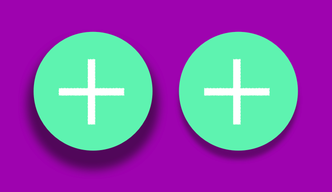
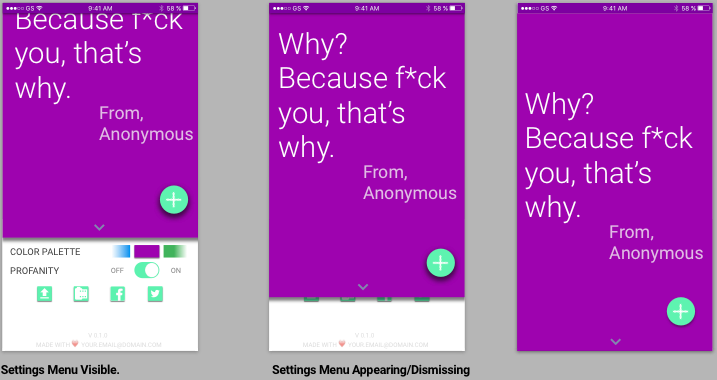
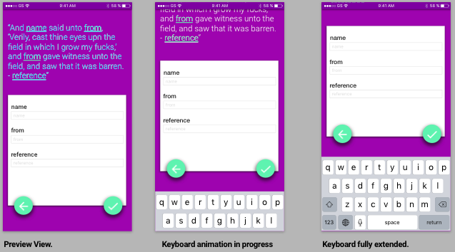
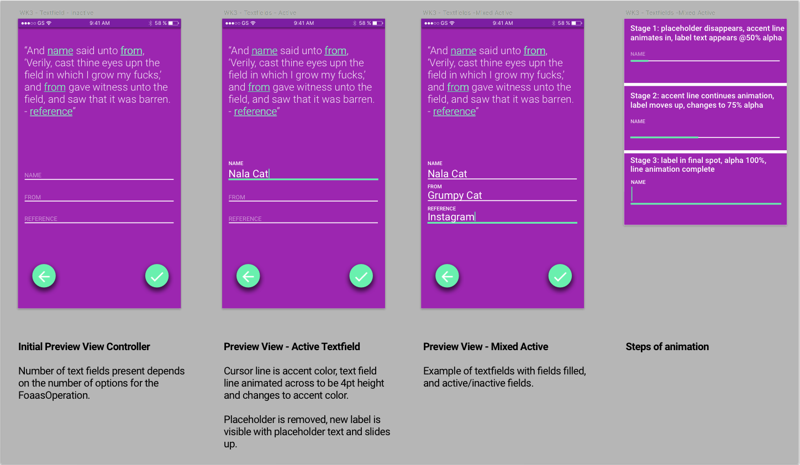

# Week 3 MVP - Project Manager Notes
---

### All hail our new leader, Material Design. 

This week's overall goal will be mostly UI/UX-focused. We have a nearly fully working app at this point, we just want to ensure that the experience in using it is plesant for our users. We that in mind, we're making a seismic shift towards using Material Design to improve the app's look and feel. 

Please take a quick moment to review the [PDF of Sprint 3's design](../Images/octo_week3_mat_design.pdf). 

*Note: I'm not sure why the buttons on the pdf have a strange white boxing effect. Refer to these additional screen shots to understand what the icons should look like (the provided assets will be correct): 

1. [Main Screen](../Images/main_view_ss.png)
2. [Operation List](../Images/operation_list_ss.png)
3. [Preview View](../Images/preview_view_ss.png)

### What is Material Design?

It's a design guide put together by Google covering every single UI/UX element and aspect of an app. We don't need to adhere to all of the guidelines they put forth, but they are usually very good guiding rules in how to design an app with a compelling user experience. Well, a Google-y experience. 

Material design's details are extensive, and we're just going to focus on a few elements: colors, fonts, layout, buttons, and shadows.

### [Color](https://material.google.com/style/color.html): Purple Palette & Teal Accent

In material design, it's suggested that you use three colors from a primary palette along with a single, accent color from a secondary palette. The accent color is mostly used to denote some sort of action or interaction. Here's a screenshot of our main color palette for this app: 

To get the proper values of the colors, see [Colors](https://material.google.com/style/color.html). The TechLead will fill you in on how to properly manage the color palettes, but we also eventually want to give people the ability to "download" additional color options - maybe even some paid. 

Though we're going to be using Purple 500 (Primary, #9C27B0), Purple 700 (Primary Dark, #7B1FA2), and Purple 100 (Primary Light, #E1BEE7). For the accent color, we'll be relying on A200 Teal (#69F0AE). 

### Roboto Font
Adding in this font is straightforward from what I understand from the tech lead; I believe you can download it from [here](https://material.google.com/resources/roboto-noto-fonts.html) and read about it [here](https://fonts.google.com/specimen/Roboto) 

But what's really important is how we're handling the fonts themselves in terms of point sizes, arrangement and opacity. 

Black text comes in 3 opacities that corresponds to their usage (this is directly from material design guidelines): 

| Opacity | Usage | 
| :-----: | :---: | 
|   87%   |Primary| 
|   54%   |Secondary|
|   38%   | Hints |

White text, similarly, has 3:

| Opacity | Usage |
| :-----: | :---: |
|   100%   |Primary|
|   70%   |Secondary|
|   50%   | Hints |

You can read about the theory if you're intereted, but here are the specs we need:

| Element | Location | Color | Opacity | Font Size | Font Weight | Font Style |
| :--- | :---: | :---: | :---: | :---: | :---: | :---: | 
| Message Text | Main View | White | 100% | 56pt | Light | Headline |
| Message Subtitle | Main View | White | 70% | 34pt  | Regular | SubHeadline | 
| Operation Name | List View | White | 100% | 34pt | Regular | Title |
| Preview Text | Preview View | White | 100% | 24pt | Light | Body |
| Text Labels | Preview View | Black | 100% | 18pt | Medium | Label |
| Placeholder Text | Preview View | Black | 34% | 13pt | Regular | Placeholder |
| Settings Labels | Settings Menu | Black | 87% | 18pt | Regular (ALL CAPS) | Settings |
| On/Off | Settings Menu | Black | 87% | 14pt | Regular (ALL CAPS) | Caption 1 |
| App Info | Settings Menu | Black | 34% | 12pt | Regular (ALL CAPS) | Caption 2 |

### Layout

Here are some examples of the layout. I'd recommend using your best judgement for the majority of the elements, attempting to get as close to the design spec as possible. If you have time/are interested, contact me for the `.sketch` file. You will need to download [Sketch](https://www.sketchapp.com/). It's $99 for a license but also comes with a free trial period that will be long enough to complete this project. 

| Location | Items | Relation |
| --- | --- | --- |
| Main Screen | Message Text, Message Subtitle | 28 - 48pt from last baseline of text to first baseline of subtitle |
| Main Screen | Message Text + Message Subtitle | Centered Y - 16pt margin from top of button |
| Main Screen | All | 16pt leading, trailing | 
| Main Screen | Disclosure indicator | 8pt from bottom, centered X |
| Main Screen | Button | 32pt from trailing, 48pt from bottom |
| Operation List | Cell | 64pt height |
| Operation List | Cell Text | 34pt font, 16pt from leading, 8pt from bottom |

### Buttons

You may want to read up on [material design's take on elevation](https://material.google.com/material-design/elevation-shadows.html) for this one, in order to try to get the shadows as close to correct as possible. Basically: 

1. All views are 1pt thick in the z-dimension
2. The z-dimension extends from 0pt height ("bottom" layer of app) to 24pt ("ceiling" layer of app)
3. Depending on the element, there are "heights" that each view should normally occupy. 
4. For interactive elements, like buttons, their "heights" change when in their active state. 

#### Example of button elevation: 
**(left: active, right: inactive)**

### Settings Menu Details

From the main screen, we want to be able to either tap on the disclosure indicator or perform a swipe up to reveal the settings menu below it. We can start with a simple animation that moves the top view up in a linear transition that lasts somewhere between `.10` and `.40` seconds... whatever you think works best. 

Right now the settings menu will have two selection components (color palette, profanity filter), 4 share options (copy/paste, save to photoroll, facebook, twitter), and two text labels (app version, your email). 

The color palette should allow users to swipe left/right between color choices, and when a choice is made the app's colors should update to use that color's palette (so that color's 100, 500, and 700 values). For testing, use blue, green and a default of purple. To make it clear that users need to swipe to make a change, we should add an alpha gradient so that the edges fade out entirely, but reveal a partial color swatch. 

Facebook/twitter integration will wait until next week. But hook up your existing work on copy/paste and screenshoting to their appropriate buttons. 

Not sure how we're going to update the version or the message at the bottom. Check with the tech lead on that one. 

### Keyboard changes
For details on this one, check in with your tech lead. But we'd like for the views to animate along with the keyboard in terms of timing and animation curves. The overall effect should appear as a smooth keyboard show/hide with the bottom of the view moving exactly with the top of the keyboard. 

### Removing the navigation bar
Design decided that the app is so simple that it doesn't make sense to have a bulky navigation bar. So we're replacing it in favor of simple gestures and buttons. Check in with the tech lead on thoughts on how to best accomplish this. 

### Textfield Design Changes (UPDATE 1/15/17)
We've adapted the design of the text fields so as to avoid different shadowing layers in the preview view. I hear from your tech lead that it isn't an easy implementation for such a minor UI feature. Maybe in the future... but for now, here's the updated design. Your tech lead will be taking point on the textfield code I believe.

