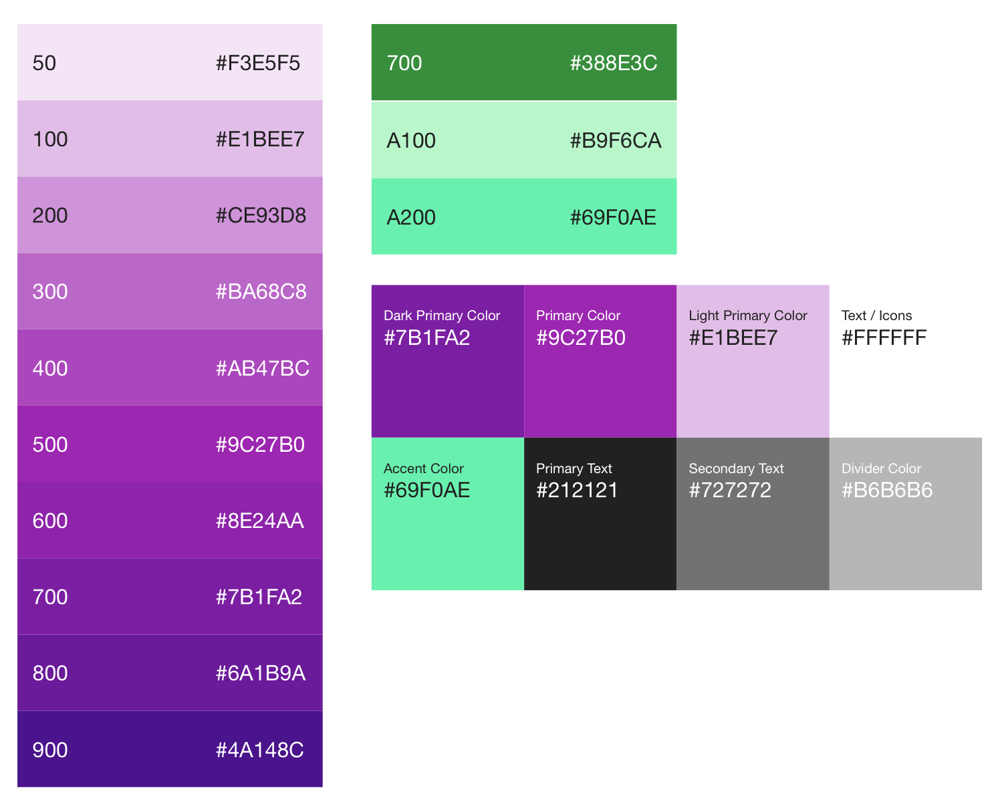

# Week 3 MVP - Project Manager Notes
---

### All hail our new leader, Material Design. 

This week's overall goal will be mostly UI/UX-focused. We have a nearly fully working app at this point, we just want to ensure that the experience in using it is plesant for our users. We that in mind, we're making a seismic shift towards using Material Design to improve the app's look and feel. 

Please take a quick moment to review the [PDF of Sprint 3's design](../Images/octo_week3_mat_design.pdf). 

*Note: I'm not sure why the buttons on the pdf have a strange white boxing effect. Refer to these additional screen shots to understand what the icons should look like (the provided assets will be correct): 

1. [Main Screen](../Image/main_view_ss.png)
2. [Operation List](../Image/operation_list_ss.png)
3. [Preview View](../Image/preview_view_ss.png)

### What is Material Design?

It's a design guide put together by Google covering every single UI/UX element and aspect of an app. We don't need to adhere to all of the guidelines they put forth, but they are usually very good guiding rules in how to design an app with a compelling user experience. Well, a Google-y experience. 

Material design's details are extensive, and we're just going to focus on a few elements: colors, fonts, layout, buttons, and shadows.

### [Color](https://material.google.com/style/color.html): Purple Palette & Teal Accent

In material design, it's suggested that you use three colors from a primary palette along with a single, accent color from a secondary palette. The accent color is mostly used to denote some sort of action or interaction. Here's a screenshot of our main color palette for this app: 

To get the proper values of the colors, see [Colors](https://material.google.com/style/color.html). The TechLead will fill you in on how to properly manage the color palettes, but we also eventually want to give people the ability to "download" additional color options - maybe even some paid. 

Though we're going to be using Purple 500 (Primary, #9C27B0), Purple 700 (Primary Dark, #7B1FA2), and Purple 100 (Primary Light, #E1BEE7). For the accent color, we'll be relying on A200 Teal (#69F0AE). 

### Roboto Font
Adding in this font is straightforward from what I understand from the tech lead; I believe you can download it from [here](https://material.google.com/resources/roboto-noto-fonts.html) and read about it [here](https://fonts.google.com/specimen/Roboto) 

But what's really important is how we're handling the fonts themselves in terms of point sizes, arrangement and opacity. 

Black text comes in 3 opacities that corresponds to their usage (this is directly from material design guidelines): 

| Opacity | Usage | 
| :-----: | :---: | 
|   87%   |Primary| 
|   54%   |Secondary|
|   38%   | Hints |

White text, similarly, has 3:

| Opacity | Usage |
| :-----: | :---: |
|   100%   |Primary|
|   70%   |Secondary|
|   50%   | Hints |

You can read about the theory if you're intereted, but here are the specs we need:

| Element | Location | Color | Opacity | Font Size | Font Weight | Font Style |
| :--- | :---: | :---: | :---: | :---: | :---: | :---: | 
| Message Text | Main View | White | 100% | 56pt | Light | Headline |
| Message Subtitle | Main View | White | 70% | 34pt  | Regular | SubHeadline | 
| Operation Name | List View | White | 100% | 34pt | Regular | Title |
| Preview Text | Preview View | White | 100% | 24pt | Light | Body |
| Text Labels | Preview View | Black | 100% | 18pt | Medium | Label |
| Placeholder Text | Preview View | Black | 34% | 13pt | Regular | Placeholder |
| Settings Labels | Settings Menu | Black | 87% | 18pt | Regular (ALL CAPS) | Settings |
| On/Off | Settings Menu | Black | 87% | 14pt | Regular (ALL CAPS) | Caption |

### Layout

Here are some examples of the layout. I'd recommend

| Location | Items | Relation |
| --- | --- | --- |
| Main Screen | Message Text, Message Subtitle | 28 - 48pt from last baseline of text to first baseline of subtitle |
| Main Screen | All | 16pt leading, trailing | 
| Main Screen | Disclosure indicator | 8pt from bottom, centered X |
| Main Screen | Button | 32pt from trailing, 48pt from bottom |
